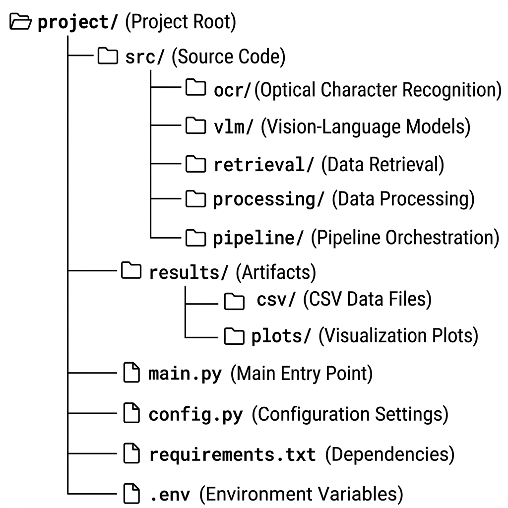

# DocVQA RAG: Comparative Analysis of Perception Strategies

This repository contains the source code for a Master's Thesis research project on **Document Visual Question Answering (DocVQA)**. The system implements a Retrieval-Augmented Generation (RAG) pipeline designed to evaluate how different document perception strategies (OCR vs. VLM) impact the accuracy and efficiency of downstream question answering.

## Project Overview

The effective understanding of scanned documents—such as invoices in banking, medical reports in healthcare, and legal contracts—remains a significant challenge for AI. This project addresses the "Perception Gap" by comparing four distinct methods for converting visual document data into a machine-readable format for Large Language Models (LLMs).

## Project Structure



The repository is organized as follows:

The codebase is organized into modular components to facilitate easy experimentation with different models.

| Component | File Path | Description |
| :--- | :--- | :--- |
| **OCR (Tesseract)** | `src/ocr/tesseract.py` | Wrapper for the traditional Tesseract OCR engine. |
| **OCR (PaddleOCR)** | `src/ocr/paddleocr.py` | Deep-learning based OCR with layout detection capabilities. |
| **Vision-Language Model** | `src/vlm/vlm_model.py` | Integration for multimodal models (e.g., LLaVA) for direct extraction. |
| **Hybrid Pipeline** | `src/pipeline/pipeline.py` | Core logic for merging OCR precision with VLM layout understanding. |
| **Retriever** | `src/retrieval/retriever.py` | Orchestration of FAISS vector search and retrieval logic. |
| **Embeddings** | `src/processing/embedding.py` | Text vectorization using SentenceTransformers. |
| **Preprocessing** | `src/processing/chunking.py` | Document segmentation and chunking strategies. |

## System Modularity

The system is built on three core pillars of modularity:
1. **Perception Independence**: Every perception strategy (Tesseract, PaddleOCR, VLM, Hybrid) implements a standardized interface, allowing them to be swapped in `main.py` without code modification.
2. **Retrieval Agnosticism**: The retrieval system operates on standardized embeddings, meaning any vector database or similarity metric can be integrated.
3. **Cognitive Flexibility**: The final reasoning layer (LLM) is decoupled from the extraction layer, ensuring compatibility with both local and API-based models.

## Execution

1. **Install Dependencies**:
   ```bash
   pip install -r requirements.txt
   ```
2. **Environment Setup**:
   Configure your `.env` file with any required API keys (if using non-local LLMs).
3. **Run Benchmark**:
   ```bash
   python main.py
   ```

## Error Analysis

Based on my research, the DocVQA pipeline's failures are categorized into four primary areas, each impacting the results differently:

1.  **OCR Misinterpretation**: Character confusion (e.g., "0" as "O") which heavily impacts **Exact Match (EM)**.
2.  **Layout Fragmentation**: Incorrect reading order in multi-column or complex tabular documents.
3.  **Retrieval Ambiguity**: The system pulls the correct label but the incorrect value due to proximity in the vector space.
4.  **Output Normalization**: Information is correct but the format differs from the ground truth (e.g., "$1k" vs. "1000").

### Comparative Vulnerability Analysis
| Error Type | Tesseract | PaddleOCR | VLM | Hybrid |
| :--- | :---: | :---: | :---: | :---: |
| **Alphanumeric Confusion** | High | Medium | Low | Low |
| **Layout Sensitivity** | High | Medium | Low | Low |
| **Hallucination Risk** | N/A | N/A | Medium | Low |

## Results

Aggregated metrics are automatically saved to `results/demo_summary.csv` and visualized in `results/plots/`. Key metrics include:
- **ANLS**: Average Normalized Levenshtein Similarity.
- **EM / F1**: Accuracy metrics for the final answer.
- **Latency / Throughput**: System efficiency benchmarks.
- **Memory**: Peak resource usage.

---
*For a detailed theoretical analysis and experimental results, please refer to the documents in the `/thesis/` and `/paper/` directories.*
