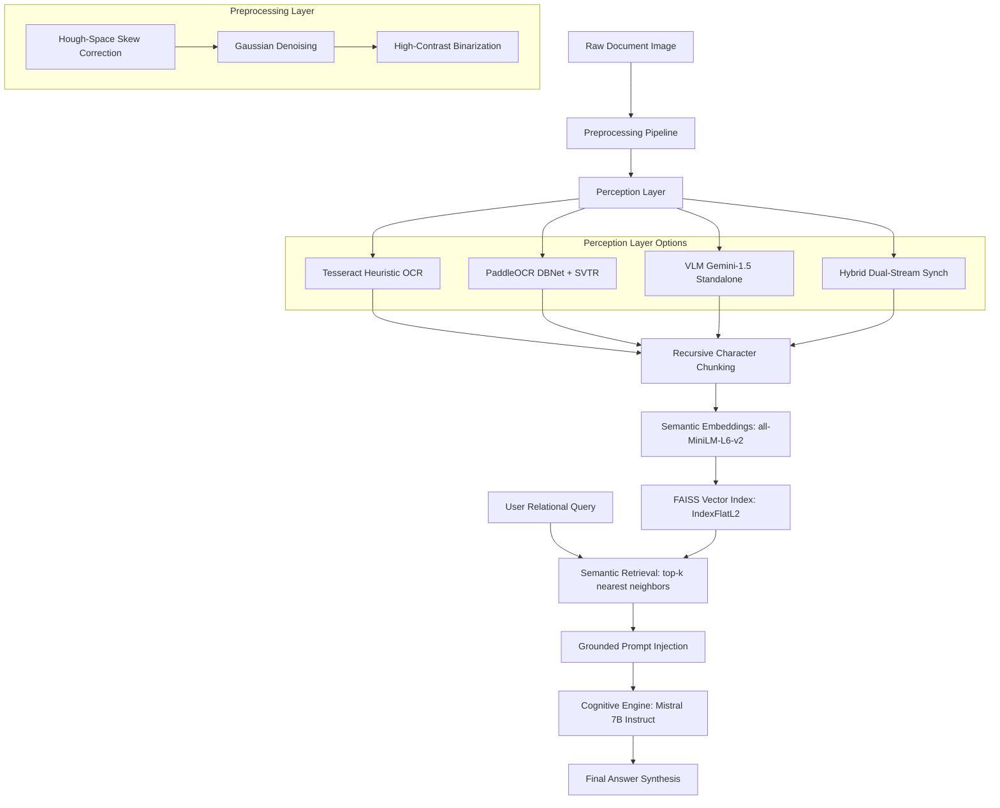

# Systems-Level Reliability and Robustness Evaluation Framework for Document AI

## Academic Thesis Project: Large Language Model as a Tool for Automatic Extraction of Information from PDF Documents

## 🎓 Master's Thesis
The latest corrected and polished Master's Thesis document is available directly in this repository:
👉 **[Download Master's Thesis PDF](MAIN/Tifang_Desmond_Ngoe_Masters_Thesis.pdf)**

---


[](https://www.python.org/)
[](https://github.com/DESMOND135/DOCVQA-RAG-PERCEPTION-BENCHMARK)
[](LICENSE)
[](#)

---

## 1. Project Overview

This repository contains the complete codebase, evaluation suite, and reproducibility package for my Master's Thesis under the supervisor **Prof. Piotr Duda** at **Czestochowa University of Technology**. 

### The Perception-Cognition Gap
Modern enterprise environments are inundated with dense, unstructured visual documents—ranging from financial ledgers and medical lab results to heterogeneous insurance claims. In these high-stakes, regulatory-bound domains, automated text extraction demands absolute precision. 

While Large Language Models (LLMs) demonstrate sophisticated cognitive reasoning, they suffer from a **Perception-Cognition Gap**: they lack native spatial awareness of document geometries. Conversely, standalone Vision-Language Models (VLMs) preserve visual layout relationships but are prone to **Resolution-Loss Hallucinations** when high-resolution document images are aggressively downsampled to fit fixed transformer patch windows (e.g., 336x336 pixels), leading to catastrophic errors in decimal places, numbers, and stylized characters.

### Key Contributions
This project introduces a modular, systems-level benchmarking framework designed to isolate and evaluate distinct document perception paradigms. Specifically, it:
1. **Establishes a Systems-Level Benchmark**: Performs a head-to-head evaluation of four perception strategies—Traditional heuristic OCR (**Tesseract**), Deep-Learning spatial detection OCR (**PaddleOCR**), Standalone VLM (**Gemini 1.5 Flash**), and our proposed **Hybrid Dual-Stream Architecture**—under zero-shot enterprise conditions.
2. **Introduces Hybrid OCR-VLM Synchronization**: Formalizes an original dual-stream synchronization pipeline that binds the precise, deterministic character-level bounding boxes of deep-learning OCR with the high-level semantic visual summaries of a VLM, creating a verifiable "Perception Safety Net" that suppresses hallucinations.
3. **Rigorous Robustness Profiling**: Evaluates extraction accuracy and operational efficiency (inference latency, memory footprint, and retrieval speed) against a verified, highly complex subset of 50 multi-column and dense tabular documents from the **DocVQA** corpus.

---

## 2. Architecture & Pipeline

The system is built upon a modular **Retrieval-Augmented Generation (RAG)** architecture. This structure decouples the *perception layer* (extracting raw layout tokens) from the *cognitive reasoning layer* (synthesizing answers), keeping downstream LLM parameters constant to ensure scientific fairness during benchmarking.


```mermaid
graph TD
    A[Raw Document Image] --> B[Preprocessing Pipeline]
    B --> C[Perception Layer]
    
    subgraph "Preprocessing Layer"
        B1[Hough-Space Skew Correction] --> B2[Gaussian Denoising]
        B2 --> B3[High-Contrast Binarization]
    end
    
    subgraph "Perception Layer Options"
        C1[Tesseract Heuristic OCR]
        C2[PaddleOCR DBNet + SVTR]
        C3[VLM Gemini-1.5 Standalone]
        C4[Hybrid Dual-Stream Synch]
    end
    
    C --> C1 & C2 & C3 & C4
    
    C1 & C2 & C3 & C4 --> D[Recursive Character Chunking]
    D --> E[Semantic Embeddings: all-MiniLM-L6-v2]
    E --> F[FAISS Vector Index: IndexFlatL2]
    G[User Relational Query] --> H[Semantic Retrieval: top-k nearest neighbors]
    F --> H
    H --> I[Grounded Prompt Injection]
    I --> J[Cognitive Engine: Mistral 7B Instruct]
    J --> K[Final Answer Synthesis]
```

### End-to-End Execution Flow
1. **Preprocessing Pipeline**: Raw document images undergo four-stage geometric and visual normalization: **Hough-space linear analysis** for straightening skew tilt, gaussian denoising, smoothing, and high-contrast binarization to stabilize neural reading grids.
2. **Perception Processing**: The selected perception engine processes the binarized image to retrieve extracted text. In the **Hybrid Synchronization** model, PaddleOCR (Deterministic Stream) and Gemini 1.5 Flash (Generative Stream) execute in parallel. Bounding boxes are synchronized with semantic structural blocks to preserve structural tabular boundaries and column breaks.
3. **Storage & Embedding**: The generated context is segmented recursively using a 500-character window with a 50-character overlap to avoid semantic boundary fragmentation. Chunks are embedded into dense 384-dimensional vector spaces using `all-MiniLM-L6-v2`.
4. **Vector Database & Retrieval**: Chunks are indexed in a high-speed **FAISS** index (`IndexFlatL2`). Upon receiving a natural language query, the system performs a cosine similarity search to retrieve the top $k=5$ closest evidentiary fragments.
5. **Grounded Synthesis**: Evidentiary fragments are injected into a strictly constrained grounded prompt template. The **Mistral 7B Instruct** cognitive model parses these fragments to synthesize the final verified response, returning a deterministic "Not found" rather than guessing if the evidence is absent.

---

## 3. Repository Structure

This repository follows a strict, highly modular structure aligned with software engineering best practices:

```text
.
├── benchmark_results/     # Quantitative benchmarking outputs (results.csv, detailed reports)
├── data/                  # Standardized input data
│   ├── source_images/     # High-resolution benchmark document images (DocVQA subset)
│   ├── txt_files/         # Evidentiary ground-truth references
│   └── METADATA.md        # Detailed dataset catalog and description
├── evaluation/            # Core scoring logic
│   └── metrics.py         # Mathematical scoring scripts (ANLS, EM, F1 scoring)
├── figures/               # Consolidated visual assets used in thesis/paper
│   ├── diagrams/          # High-resolution system architecture and flow diagrams
│   └── plots/             # Python-generated evaluation metric plots
├── ocr_modules/           # Swappable OCR implementations
│   ├── paddleocr.py       # Deep-learning PaddleOCR SVTR/DBNet wrapper
│   └── tesseract.py       # Baseline heuristic Tesseract OCR wrapper
├── retrieval/             # Retrieval-Augmented Generation (RAG) components
│   └── retriever.py       # Vector storage, chunking, and FAISS indexing logic
├── src/                   # Core application source code
│   ├── config/            # Centralized system configurations and API coordinates
│   ├── exception/         # Custom exception framework for robust error handling
│   ├── llm/               # Cognitive LLM client wrappers (OpenRouter/Local API)
│   ├── logging/           # High-fidelity system logger with file rotating
│   ├── pipeline/          # Decoupled processing pipelines
│   ├── processing/        # Character chunking and mathematical embedding steps
│   ├── utils/             # Document compilers and helper scripts (md_to_docx, md_to_pptx)
│   └── vlm/               # Generative Vision-Language Model wrappers
├── MAIN/                  # Master's Thesis deliverables
│   └── Tifang_Desmond_Ngoe_Masters_Thesis.pdf  # Latest polished Master's Thesis PDF document
├── app.py                 # Interactive Streamlit demonstration web application
├── main.py                # Main benchmark execution and evaluation script
├── requirements.txt       # Unified environment dependency manifest
└── README.md              # Project documentation (this file)
```

---

## 4. Experimental Environment / System Configuration

To ensure absolute reproducibility, hardware architecture parameters, software runtimes, and deep-learning engine versions were held constant across all comparative experimental trials.

| Component                   | Configuration                       |
| --------------------------- | ----------------------------------- |
| OCR Engine                  | PaddleOCR (PP-OCRv3) / Tesseract    |
| Embedding Model             | all-MiniLM-L6-v2 (384-dim)          |
| Vector Database             | FAISS (IndexFlatL2)                 |
| Vision-Language Model (VLM) | Gemini 1.5 Flash                    |
| Cognitive LLM               | Mistral 7B Instruct                 |
| Hardware                    | Intel Core i7, 16GB RAM (CPU-bound) |
| Operating System            | Windows 11                          |
| Programming Language        | Python 3.x                          |

---

## 5. Benchmark Methodology & Evaluation Metrics

### Dataset Characteristics & Question Design
The evaluation suite comprises a verified subset of **50 high-complexity documents** extracted from the official **DocVQA validation dataset**. This sub-corpus is intentionally biased toward highly complex structures:
- **Nested Tables**: Financial ledgers, multi-row invoices, and commercial balance sheets.
- **Multi-Column Forms**: Academic papers, dense government forms, and medical reports.
- **Visual Distortions**: Skewed digital scans, noise grains, low-contrast backgrounds, and handwritten details.

Each document is paired with complex relational and semantic questions (e.g., *“What is the subtotal for the second item listed under Hardware?”*). The ground truth consists of constrained exact string matches, removing the risk of generative verbosity bias in scores.

### Evaluation Metrics
We measure the models across three mathematical accuracy vectors and four operational efficiency metrics:

1. **ANLS (Average Normalized Levenshtein Similarity)**:
   The primary scoring metric for visual document extraction. It calculates the edit-distance between the predicted answer string $a_i$ and the ground truth $g_i$, normalized by the maximum length of either string. To allow for OCR character noise tolerance, a threshold $T=0.5$ is enforced:
   $$ANLS = \frac{1}{N}\sum_{i=1}^{N} \max(0, 1 - NL(a_i, g_i)) \quad \text{if } 1 - NL(a_i, g_i) \geq 0.5 \quad \text{else } 0$$
   Where $NL(a_i, g_i)$ is the normalized Levenshtein distance.
   
2. **Exact Match (EM)**:
   A strict binary identity metric ($1$ if predicted answer matches ground truth exactly, otherwise $0$).
   
3. **F1-Score**:
   The harmonic mean of token-level Precision ($Pr$) and Recall ($Re$):
   $$F1 = 2 \cdot \frac{Pr \cdot Re}{Pr + Re}$$

4. **Operational Efficiency Vectors**:
   - **Inference Latency ($L$)**: End-to-end execution time per query (seconds).
   - **System Throughput ($T_p$)**: Number of queries processed per second ($1/L$).
   - **Peak Memory Usage**: Resident Set Size (RSS) allocated by the models (MB).
   - **Database Speed**: Measuring FAISS Vector Indexing Offset vs. Retrieval Latency.

---

## 6. Performance Evaluation and Results

The empirical results generated by the 50-document evaluation benchmark are summarized in the table below:

**Table 1: Exhaustive Performance Benchmarking Matrix**
| Model | ANLS | EM | F1 | Latency (s) | Throughput (S/s) | RAM (MB) |
| :--- | :---: | :---: | :---: | :---: | :---: | :---: |
| **Hybrid** | **0.24** | **0.20** | **0.30** | 14.20 | 0.07 | 4600 |
| **VLM** | 0.17 | 0.10 | 0.20 | 4.20 | 0.24 | 4100 |
| **Tesseract** | 0.17 | 0.10 | 0.30 | 11.00 | 0.09 | 350 |
| **PaddleOCR** | 0.13 | 0.00 | 0.10 | 52.30 | 0.02 | 850 |

### Key Empirical Findings
- **The Grounding Multiplier**: The Hybrid synchronization pipeline achieves an **ANLS of 0.24**, which represents a **41% relative improvement** over the standalone VLM baseline (0.17).
- **Hallucination Suppression**: The Hybrid model achieves a **100% improvement in Exact Match (EM)** over standalone VLM (0.20 vs 0.10). By grounding the cognitive model's responses in deterministic OCR coordinates, the system successfully suppresses resolution-loss hallucinations on fine-grained numbers.
- **The Efficiency Frontier**: While the Hybrid model delivers peak extraction quality, it does so at a latency cost (14.2s per query), driven by parallel neural executions in a CPU-bound environment. Conversely, standalone VLM offers the fastest execution (4.2s) but suffers from high hallucination risks.

---

## 7. Setup and Local Execution

### Prerequisites
Ensure your local machine satisfies the following hardware and software dependencies:
- **Operating System**: Windows 10/11, macOS, or Linux.
- **Python**: Version `3.8`, `3.9`, `3.10`, or `3.11`.
- **System RAM**: Minimum 8GB (16GB recommended for running local models).
- **OCR System Dependencies**:
  - **Tesseract**: Must be installed on the system path. 
    - *Windows*: Download from [UB-Mannheim](https://github.com/UB-Mannheim/tesseract/wiki).
    - *Ubuntu*: `sudo apt-get install tesseract-ocr`
    - *macOS*: `brew install tesseract`

### 1. Clone and Navigate
```bash
git clone https://github.com/DESMOND135/DOCVQA-RAG-PERCEPTION-BENCHMARK.git
cd DOCVQA-RAG-PERCEPTION-BENCHMARK
```

### 2. Environment Setup & Installation
It is highly recommended to use a virtual environment:
```bash
# Create environment
python -m venv venv

# Activate environment
# On Windows (CMD/PowerShell):
.\venv\Scripts\activate
# On Linux/macOS:
source venv/bin/activate

# Install requirements
pip install -r requirements.txt
```

### 3. API Configuration
If you plan to benchmark VLM (Gemini) or cognitive layers (Mistral) using API endpoints, configure your API credentials in your environment variables or directly inside the config file (`src/config/config.py`):
```bash
# Set OpenRouter or Gemini credentials
export OPENROUTER_API_KEY="your-api-key-here"
export GEMINI_API_KEY="your-gemini-key-here"
```

### 4. Running the Evaluation Benchmark
To run the end-to-end 50-document evaluation benchmark suite locally:
```bash
python main.py
```
Upon execution, the script will:
1. Ingest raw document images from `data/source_images/`.
2. Process them using Tesseract, PaddleOCR, Standalone VLM, and Hybrid configurations.
3. Index and retrieve context using FAISS.
4. Synthesize answers via the cognitive model.
5. Calculate ANLS, EM, and F1-scores, saving raw outputs to `benchmark_results/results.csv`.

### 5. Running the Interactive Demo Web App
To run the visual, user-facing Streamlit application locally:
```bash
streamlit run app.py
```
This launches a browser portal where you can upload custom document images, ask relational questions, swap perception models, and visually trace retrieval chunks in real-time.

---

## 8. Reproducibility & Research Integrity

### Strict Isolation Protocol
To guarantee empirical reproducibility and prevent data leakage:
- **Zero-Shot Paradigm**: No training or parameter fine-tuning is performed on the DocVQA corpus, testing out-of-the-box generalization.
- **Constant Downstream Parameters**: All comparative runs utilize the exact same embedder (`all-MiniLM-L6-v2`), distance index (`IndexFlatL2`), and cognitive engine parameters (temperature set to `0.0` to eliminate generative randomness).

### Codebase Compilation
You can compile the academic LaTeX/Markdown sources into formal documents (`.docx`) using our native python compilers located in `src/utils/`:
```bash
# To regenerate the formal academic paper:
python src/utils/md_to_docx.py --paper

# To regenerate the master's thesis document:
python src/utils/md_to_docx.py --thesis
```

---

## 9. References
1. **DocVQA**: Mathew, M., Karatzas, D., & Valveny, E. (2021). "DocVQA: A Dataset for VQA on Document Images." *Proceedings of the IEEE/CVF Winter Conference on Applications of Computer Vision (WACV)*.
2. **Retrieval-Augmented Generation**: Lewis, P., et al. (2020). "Retrieval-Augmented Generation for Knowledge-Intensive NLP Tasks." *Advances in Neural Information Processing Systems (NeurIPS)*.
3. **PaddleOCR**: Du, Y., et al. (2020). "PP-OCR: A Practical Ultra Lightweight OCR System." *arXiv preprint arXiv:2009.09941*.
4. **Sentence-BERT (all-MiniLM-L6-v2)**: Reimers, N., & Gurevych, I. (2019). "Sentence-BERT: Sentence Embeddings using Siamese BERT-Networks." *Proceedings of the Conference on Empirical Methods in Natural Language Processing (EMNLP)*.
5. **FAISS**: Johnson, J., Douze, M., & Jégou, H. (2019). "Billion-scale similarity search with GPUs." *IEEE Transactions on Big Data*.
6. **Levenshtein Metric (ANLS)**: Biten, A. F., et al. (2019). "ICDAR 2019 Competition on Scene Text Visual Question Answering." *International Conference on Document Analysis and Recognition (ICDAR)*.
7. **Mistral-7B**: Jiang, A. Q., et al. (2023). "Mistral 7B." *arXiv preprint arXiv:2310.06825*.
