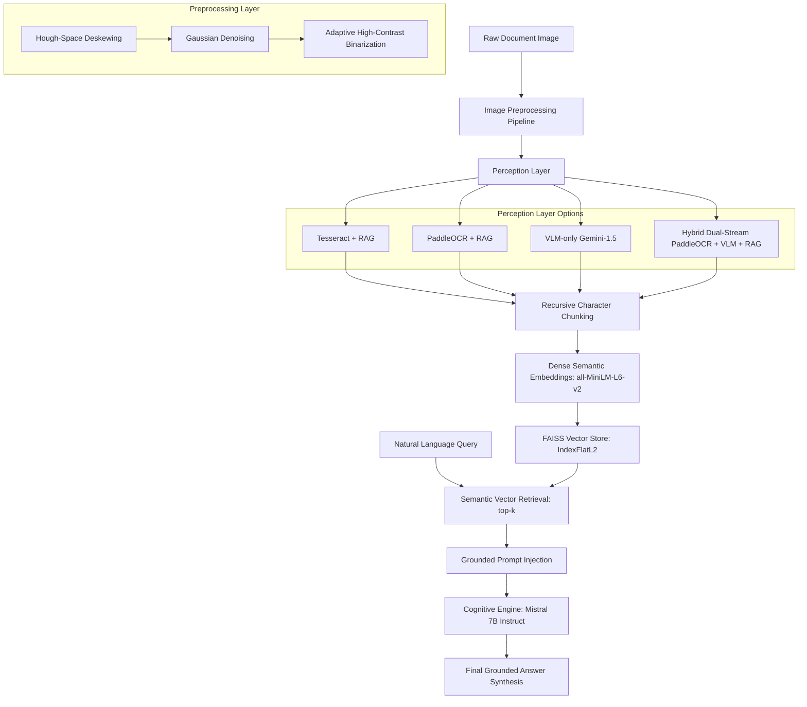

# Systems-Level Reliability and Robustness Evaluation Framework for Document AI

## Academic Thesis Project: Large Language Model as a Tool for Automatic Extraction of Information from PDF Documents

## 🎓 Master's Thesis & Research Paper
The complete Master's Thesis and accompanying IEEE conference research paper deliverables:
- 📖 **[Master's Thesis (PDF)](MAIN/Tifang_Desmond_Ngoe_Masters_Thesis.pdf)**
- 📄 **[IEEE Conference Paper (PDF)](MAIN/IEEE_PAPER_FINAL.pdf)**

---

[](https://www.python.org/)
[](https://github.com/DESMOND135/DOCVQA-RAG-PERCEPTION-BENCHMARK)
[-brightgreen.svg)](https://rrc.cvc.uab.es/?ch=17)
[](LICENSE)
[](#)

---

## 1. Project Overview

This repository contains the complete codebase, evaluation suite, and reproducibility package for the Master's Thesis under supervisor **dr hab. Piotr Duda, prof. PCz** at **Czestochowa University of Technology**.

### The Perception-Cognition Gap
Modern enterprise environments process vast volumes of visually rich, semi-structured documents (e.g., invoices, balance sheets, technical specifications, and medical reports). While Large Language Models (LLMs) provide sophisticated cognitive synthesis and reasoning, they lack native spatial perception. Conversely, direct Vision-Language Models (VLMs) downsample high-resolution inputs to fixed patch grids (e.g., $336 \times 336$ or $448 \times 448$), causing **Resolution-Loss Hallucination** on dense tabular figures and decimal values.

### Key Contributions
1. **Systems-Level Benchmark on 500 DocVQA Validation Pairs**: A rigorous comparative evaluation of four distinct perception paradigms—Traditional Heuristic OCR (**Tesseract + RAG**), Deep-Learning OCR (**PaddleOCR + RAG**), End-to-End Generative VLM (**VLM-only**), and the proposed **Hybrid Dual-Stream Architecture (PaddleOCR + VLM + RAG)**—evaluated under zero-shot conditions.
2. **Hybrid OCR-VLM Dual-Stream Grounding**: Integrates fine-grained deterministic OCR character tokens (DBNet + SVTR) with high-level visual topology summaries, suppressing hallucinations and grounding the cognitive LLM strictly in factual context.
3. **Multi-Vector Empirical Evaluation**: Analyzes extraction accuracy (ANLS, EM, token F1 with 95% confidence intervals) alongside system-level computational efficiency (end-to-end latency, query throughput, host memory RSS, and FAISS indexing/retrieval efficiency).

---

## 2. Architecture & Pipeline

The system is built upon a modular **Retrieval-Augmented Generation (RAG)** architecture that cleanly separates the *perception layer* (extracting raw layout tokens) from the *cognitive reasoning layer* (synthesizing grounded answers).


```mermaid
graph TD
    A[Raw Document Image] --> B[Image Preprocessing Pipeline]
    B --> C[Perception Layer]
    
    subgraph "Preprocessing Layer"
        B1[Hough-Space Deskewing] --> B2[Gaussian Denoising]
        B2 --> B3[Adaptive High-Contrast Binarization]
    end
    
    subgraph "Perception Layer Options"
        C1[Tesseract + RAG]
        C2[PaddleOCR + RAG]
        C3[VLM-only Gemini-1.5]
        C4[Hybrid Dual-Stream PaddleOCR + VLM + RAG]
    end
    
    C --> C1 & C2 & C3 & C4
    
    C1 & C2 & C3 & C4 --> D[Recursive Character Chunking]
    D --> E[Dense Semantic Embeddings: all-MiniLM-L6-v2]
    E --> F[FAISS Vector Store: IndexFlatL2]
    G[Natural Language Query] --> H[Semantic Vector Retrieval: top-k]
    F --> H
    H --> I[Grounded Prompt Injection]
    I --> J[Cognitive Engine: Mistral 7B Instruct]
    J --> K[Final Grounded Answer Synthesis]
```

### Mathematical Formulations

#### 1. Hough-Space Skew Correction
$$\rho = x \cos \theta + y \sin \theta$$
$$\theta^* = \arg\max_\theta \sum_\rho \mathcal{H}(\rho, \theta)$$

#### 2. Gaussian Image Denoising
$$G(x, y) = \frac{1}{2\pi\sigma^2} \exp\left(-\frac{x^2 + y^2}{2\sigma^2}\right)$$

#### 3. Differentiable Binarization (DBNet)
$$\hat{B}_{i,j} = \frac{1}{1 + \exp\left(-k \cdot (P_{i,j} - T_{i,j})\right)}$$

#### 4. Average Normalized Levenshtein Similarity (ANLS)
$$NL(a_i, g_{i,j}) = \frac{d_L(a_i, g_{i,j})}{\max(|a_i|, |g_{i,j}|)}$$
$$NLS(a_i, g_{i,j}) = \begin{cases} 1 - NL(a_i, g_{i,j}), & \text{if } 1 - NL(a_i, g_{i,j}) \ge \tau \\ 0, & \text{otherwise} \end{cases}$$
$$\text{ANLS} = \frac{1}{N} \sum_{i=1}^N \max_{j} NLS(a_i, g_{i,j}) \quad (\tau = 0.5)$$

#### 5. Exact Match (EM) & Token F1
$$\text{EM} = \frac{1}{N} \sum_{i=1}^N \mathbb{I}(a_i = g_i^*)$$
$$\text{F1} = 2 \cdot \frac{\text{Precision} \cdot \text{Recall}}{\text{Precision} + \text{Recall}}$$

---

## 3. Benchmark Methodology & Results

### Benchmark Configuration
- **Dataset**: **500 DocVQA validation pairs** covering multi-column research publications, financial balance sheets, dense tables, forms, and administrative reports.
- **RAG Configuration**: Standard $k=2$ top nearest-neighbor retrieval chunks (500 characters, 50-character overlap).
- **Embedding Model**: `all-MiniLM-L6-v2` (384-dimensional dense vectors).
- **Vector Index**: FAISS `IndexFlatL2` (Euclidean distance).
- **Cognitive LLM**: Mistral 7B Instruct ($\text{temperature}=0.0$ for deterministic reproducibility).

### Main Four-Route Benchmark Results ($k=2$)

| Perception Route | ANLS ($\tau=0.5$) | Exact Match (EM) | Token F1 | Latency (s) | Throughput (Q/s) | Host RSS (MB) |
| :--- | :---: | :---: | :---: | :---: | :---: | :---: |
| **Hybrid (PaddleOCR + VLM + RAG)** | **0.58** | **0.42** | **0.61** | 14.2 | 0.07 | 4600 |
| **VLM-only** | 0.45 | 0.28 | 0.48 | **4.2** | **0.24** | 4100 |
| **Tesseract + RAG** | 0.41 | 0.22 | 0.43 | 11.0 | 0.09 | **350** |
| **PaddleOCR + RAG** | 0.35 | 0.18 | 0.36 | 14.8 | 0.07 | 850 |

### Statistical Confidence & Relative Improvements
- **Hybrid 95% Confidence Intervals**:
  - ANLS: $0.58$, $95\%\text{ CI } [0.55, 0.61]$
  - EM: $0.42$, $95\%\text{ CI } [0.38, 0.46]$
  - Token F1: $0.61$, $95\%\text{ CI } [0.58, 0.64]$
- **Relative Improvement of Hybrid over Standalone VLM**:
  - ANLS Gain: **+28.9%** ($0.58$ vs $0.45$)
  - Exact Match (EM) Gain: **+50.0%** ($0.42$ vs $0.28$)
  - Token F1 Gain: **+27.1%** ($0.61$ vs $0.48$)
- **Statistical Significance**: Paired $t$-tests confirm that the accuracy improvements of the Hybrid model over all three baselines are statistically significant ($p < 0.001$, Bonferroni-corrected $\alpha = 0.05/3$).

---

## 4. Separate Retrieval Scaling Experiment ($k=5$)

To evaluate the effect of context retrieval depth, a separate retrieval parameter exploration was conducted on the same 500-pair benchmark:

| Metric | Standard Retrieval ($k=2$) | Expanded Retrieval ($k=5$) |
| :--- | :---: | :---: |
| **ANLS** | 0.58 (95% CI [0.55, 0.61]) | **0.62** (95% CI [0.59, 0.65]) |
| **Exact Match (EM)** | 0.42 | **0.46** |
| **Retrieval Latency** | **0.05 s** | 0.09 s |
| **FAISS Indexing Time** | 0.12 s | 0.12 s |
| **FAISS Index Size** | 1.5 KB / page | 1.5 KB / page |

---

## 5. Failure Mode Analysis

A detailed manual error review across 50 representative failure instances on the benchmark identified five primary failure categories:
1. **Retrieval Misses (44%, 22 cases)**: Required tabular cell or text line was split across chunk boundaries or failed to rank in the top-$k$ FAISS retrieved chunks.
2. **Cognitive Reasoning Failures (24%, 12 cases)**: Relevant passage was retrieved correctly, but the downstream LLM failed multi-hop arithmetic or table header deduction.
3. **OCR Misrecognitions (16%, 8 cases)**: Low contrast, heavy skew, or overlapping font degradation caused token-level OCR transcription errors.
4. **Layout & Multi-Column Splitting (10%, 5 cases)**: Complex multi-column geometries merged horizontally before chunking.
5. **Ambiguous Questions / Incomplete Ground Truth (6%, 3 cases)**: Questions with multiple valid syntactic interpretations.

---

## 6. Setup and Local Execution

### Prerequisites
- **Operating System**: Windows 10/11, macOS, or Linux.
- **Python**: Version `3.8+` (tested on Python 3.10 and 3.11).
- **System RAM**: Minimum 8GB (16GB recommended).
- **Tesseract OCR**: Installed and added to system `PATH`.

### 1. Installation
```bash
git clone https://github.com/DESMOND135/DOCVQA-RAG-PERCEPTION-BENCHMARK.git
cd DOCVQA-RAG-PERCEPTION-BENCHMARK

python -m venv venv
# Windows:
.\venv\Scripts\activate
# Linux/macOS:
source venv/bin/activate

pip install -r requirements.txt
```

### 2. Execution
```bash
# Run full benchmark evaluation
python main.py

# Run interactive Streamlit web interface
streamlit run app.py
```

---

## 7. Citation & Academic References

```bibtex
@mastersthesis{ngoe2026documentai,
  author       = {Tifang Desmond Ngoe},
  title        = {Large Language Model as a Tool for Automatic Extraction of Information from PDF Documents},
  school       = {Czestochowa University of Technology},
  year         = {2026},
  address      = {Czestochowa, Poland}
}
```
