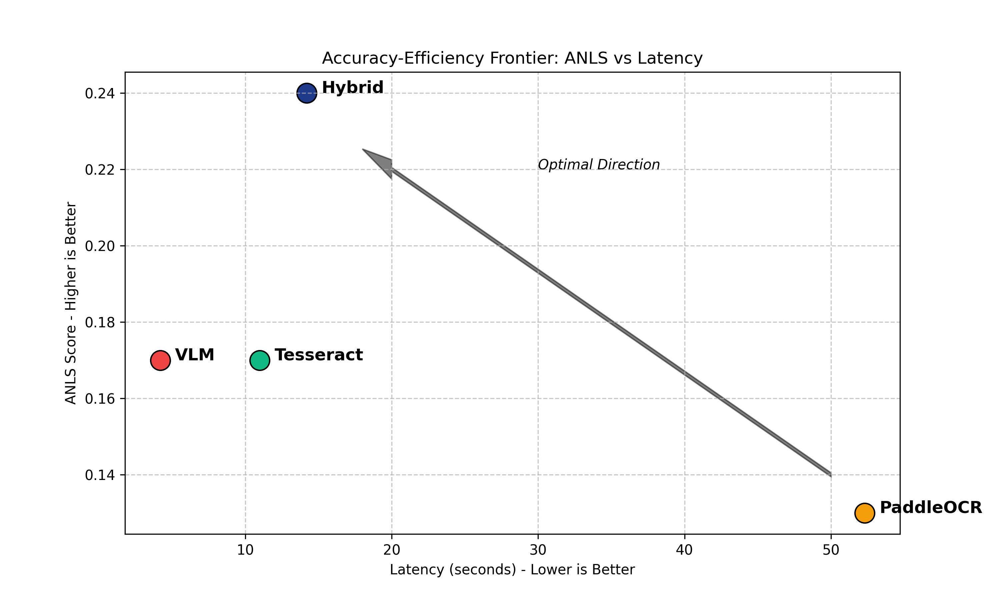
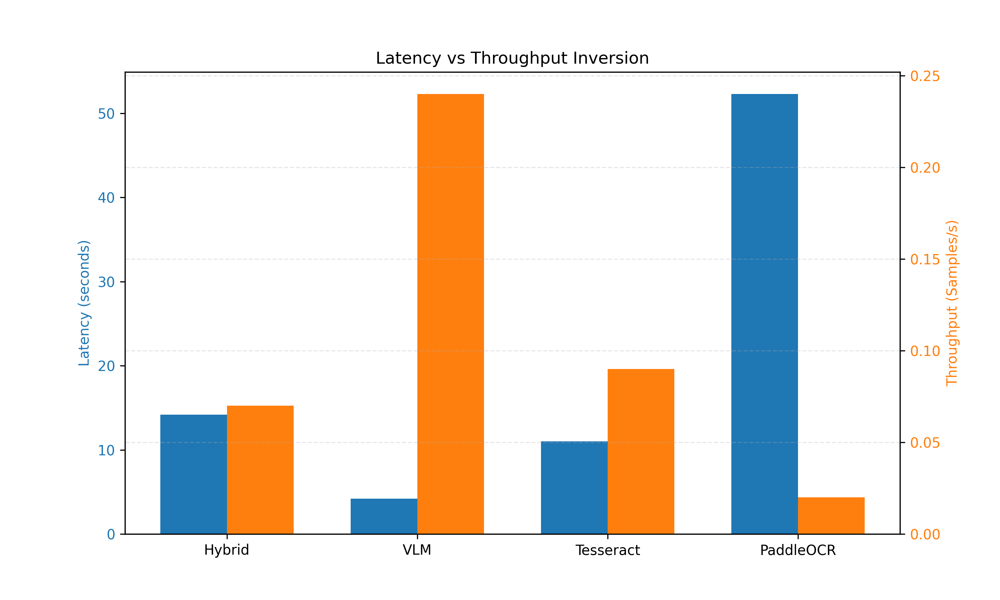
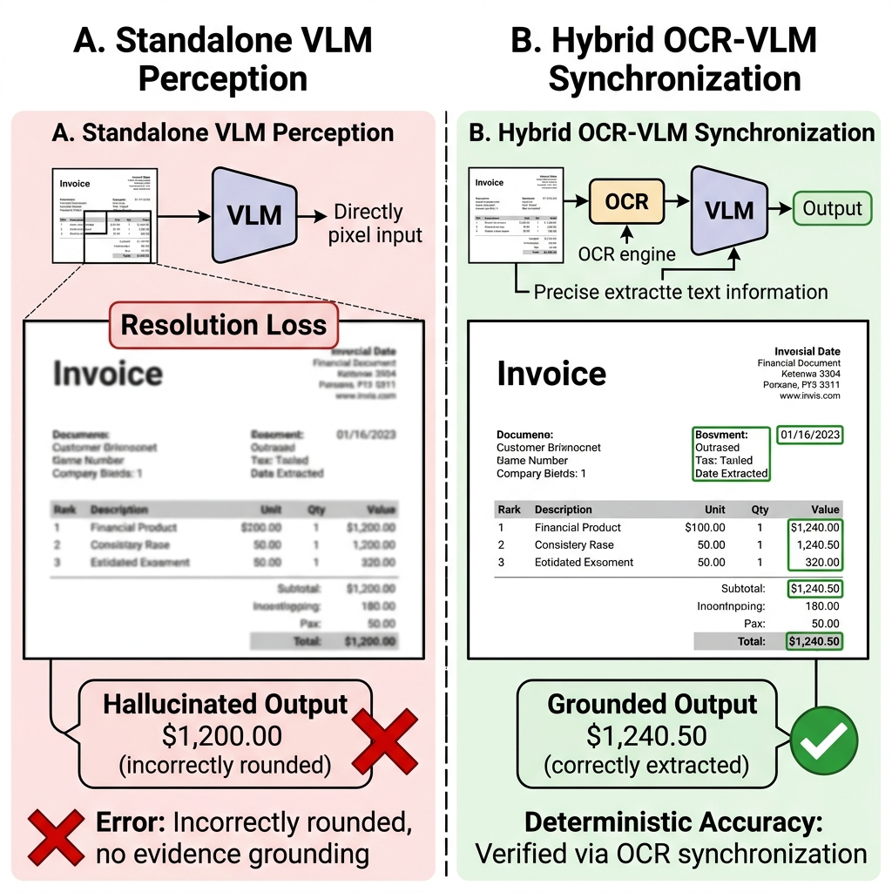

# Systems-Level Reliability and Robustness Evaluation Framework for Document AI
**Master's Thesis Defense**  
Bridging the Perception-Cognition Gap in Multimodal Reasoning  
Academic Year 2025-2026

---

## The Motivation: High-Risk Document AI
- **The Challenge**: Mission-critical sectors (Finance, Healthcare) require exact precision from unstructured PDFs.
- **The Bottleneck**: Standalone Large Language Models (LLMs) are linguistically robust but lack spatial awareness of document geometries.
- **The Perception-Cognition Gap**: A fundamental disconnect between a model's reasoning capacity and its ability to "see" fine-grained textual evidence.
- **The Cost of Failure**: Hallucination-related errors and structural data corruption in automated pipelines.

---

## The Research Gap: Heuristics vs. Generative
- **Traditional OCR (Tesseract)**: Preserves literal characters but linearizes text horizontally, causing **Structural Fragmentation** in multi-column layouts.
- **Standalone VLMs (Gemini, LLaVA)**: Elegant multimodal perception but limited by **Resolution-Loss Hallucination** in dense tabular regions.
- **The Missing Link**: A lack of rigorous, systems-level benchmarking that evaluates the reliability trade-offs between deterministic parsing and semantic layout mapping.

---

## Proposed Solution: Hybrid Dual-Stream Synchronization
- **Core Strategy**: Simultaneously process two independent data streams:
  - **Stream 1 (Deterministic)**: PaddleOCR for high-precision character and bounding-box detection.
  - **Stream 2 (Semantic)**: Vision-Language Model for visual layout summarization and structural context.
- **Grounding Reliability**: Grounding the generative visual summary in the deterministic OCR character sequence to suppress resolution-loss errors.

---

## System Architecture: Modular Evaluation Pipeline

- **Layout-Aware Retrieval**: Fusing character tokens and spatial embeddings in a shared vector space (FAISS).
- **Zero-Shot Protocol**: Evaluating out-of-the-box robustness without task-specific fine-tuning.

---

## Mathematical Formalization of Reliability
- **Hybrid Synchronization (1.1)**: $C = S_{ocr} \parallel S_{vlm}$
- **Accuracy Metric: ANLS (3.1)**:
  $$ANLS = \frac{1}{N}\sum_{i=1}^{N} s(a_i,g_i)$$
- **Fidelity Metric: Exact Match (3.2)**: Binary indicator of absolute precision.
- **Efficiency Metric: Throughput (3.5)**: $T_p = 1/L$
- **Grounding**: $s(a_i, g_i) = (1 - NL(a_i, g_i)) \text{ if } NL(a_i, g_i) < 0.5 \text{ else } 0$

---

## Benchmarking Results: The Accuracy-Efficiency Frontier

- **Performance Delta**: The Hybrid model achieves higher ANLS scores over standalone VLMs in dense tabular environments.
- **Observation**: Improving perception fidelity requires a significant computational trade-off in inference latency.

---

## Quantitative Evidence: Efficiency & Memory

- **Throughput Inversion**: While VLMs provide higher throughput, their reliability in zero-shot extractions is significantly lower than grounded hybrid architectures.
- **Resource Footprint**: Hybrid models demand higher memory (RSS) due to dual-stream synchronization overhead.

---

## Qualitative Analysis: Visualizing Failure Modes

- **VLM Failure**: Resolution-loss causes rounding errors and "probabilistic guessing" in financial figures.
- **Hybrid Remediation**: Deterministic OCR grounding recovers exact alphanumeric sequences ($1,240.50$ vs $1,200.00$).

---

## Discussion: Structural Robustness & Limitations
- **Adversarial Complexity**: Low absolute ANLS scores reflect the benchmark's focus on high-complexity, multi-column adversarial layouts rather than dataset scale.
- **Computational Overhead**: Dual-stream synchronization increases latency, necessitating future GPU-accelerated optimization.
- **Generalization**: Reliability performance remains dependent on embedding fidelity and OCR extraction quality.

---

## Conclusion and Future Directions
- **Conclusion**: Fusing literal character grounding with semantic layout awareness is essential for mitigating hallucinations in mission-critical Document AI.
- **Future Work**:
  - Scaling across dense tabular-specific corpora (TabFact).
  - Investigating natively layout-aware architectures (LayoutLMv3).
  - GPU-accelerated asynchronous tensor processing for reduced latency.

---

# Thank You
**Questions & Discussion**  
Systems-Level Reliability Evaluation of Multimodal Document AI
