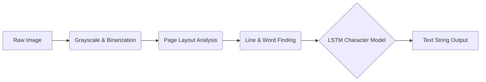
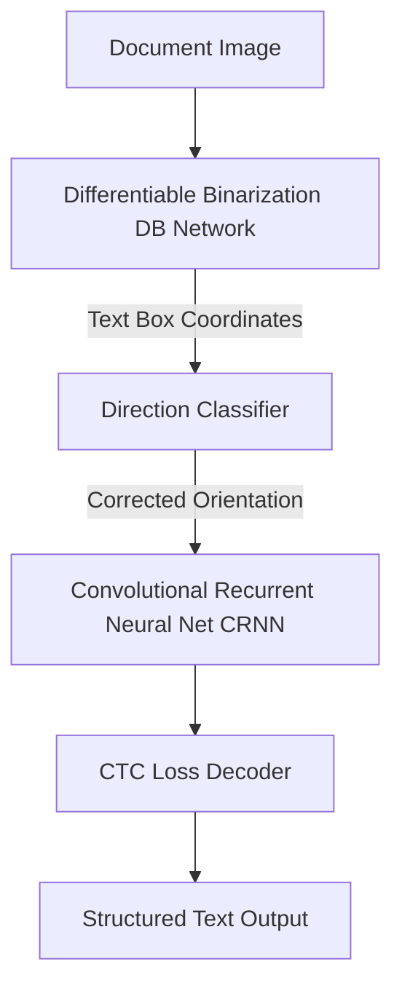
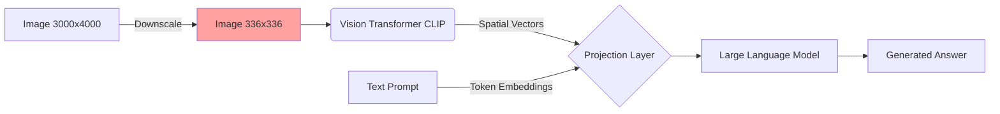
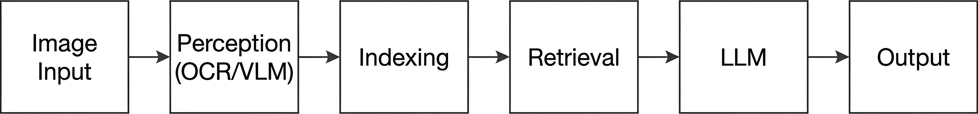
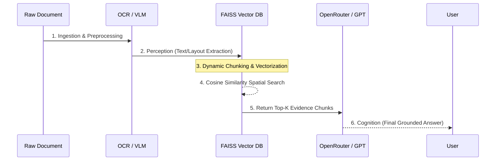
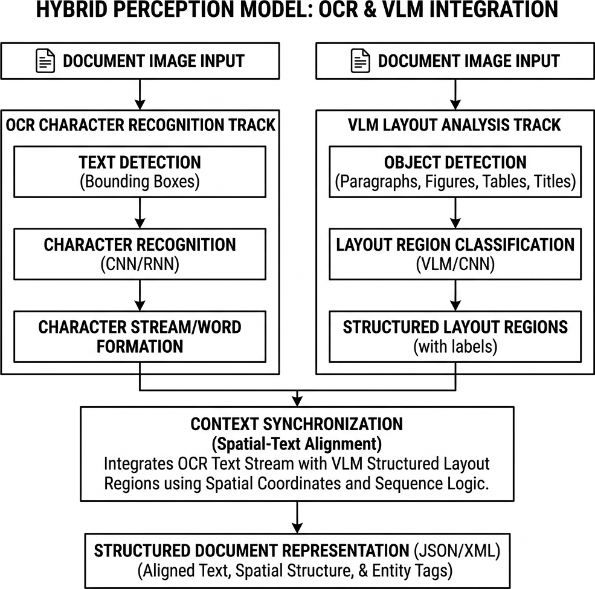
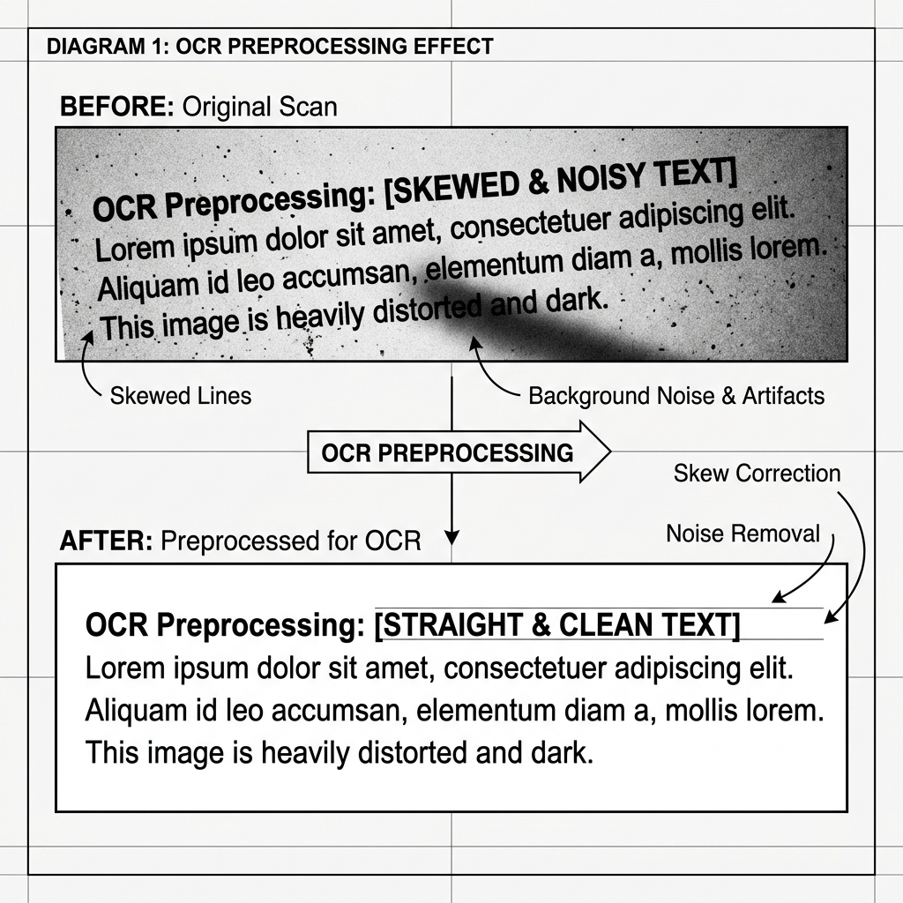
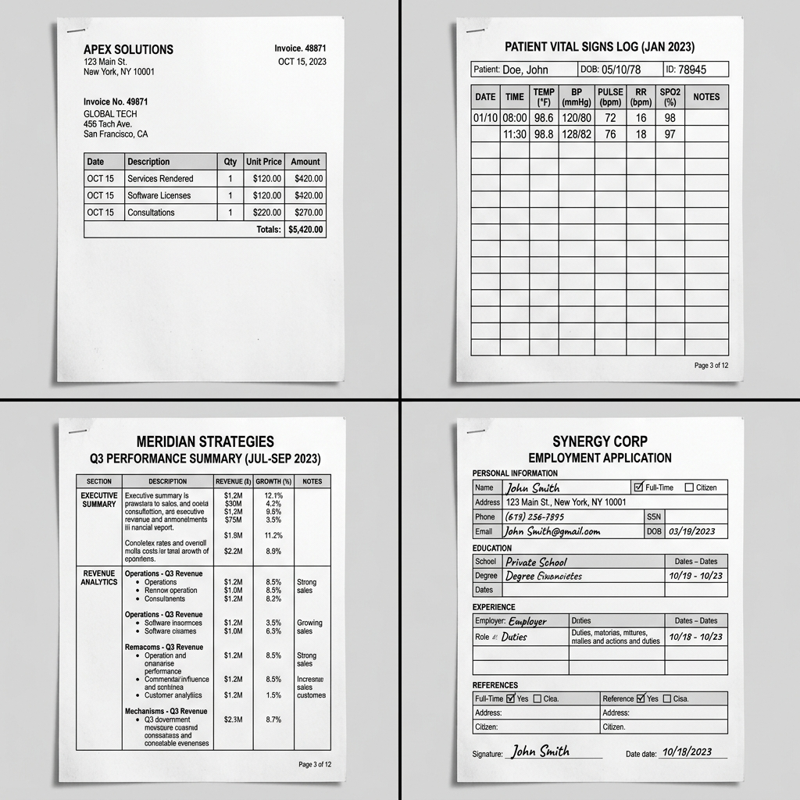
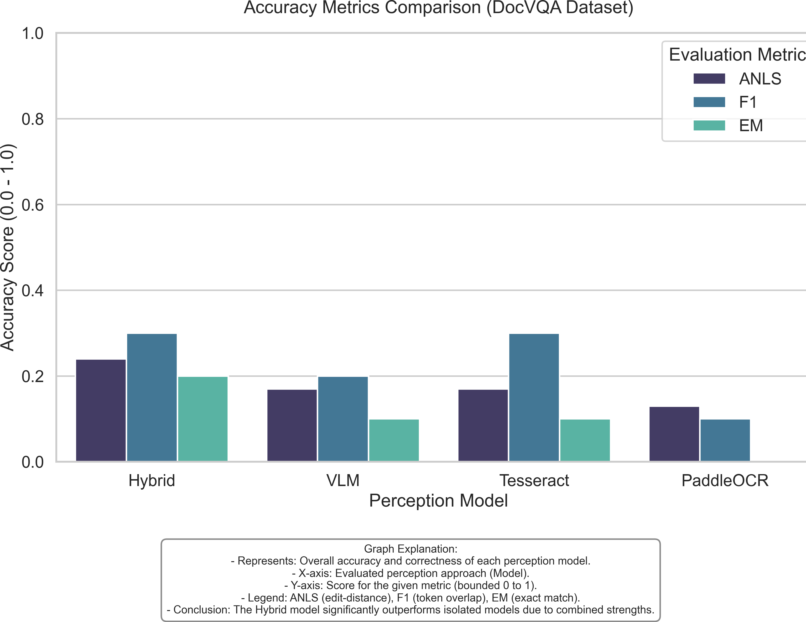
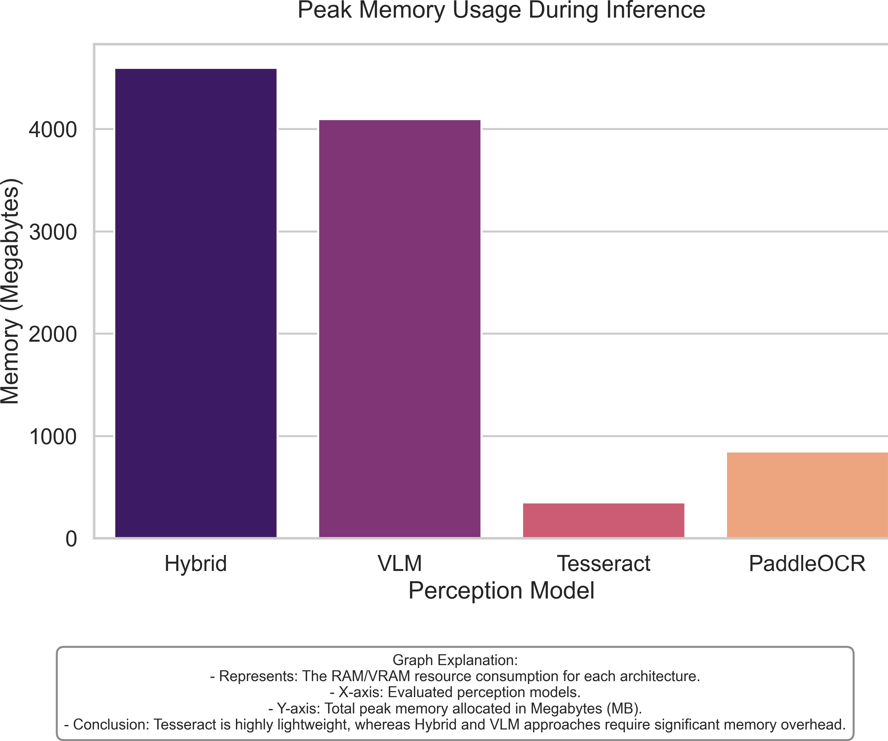

# Large Language Model as a Tool for Automatic Extraction of Information from PDF Documents

**Master's Thesis in Computer Science**  
**Academic Year:** 2025-2026

---

## Abstract

This thesis investigates the efficacy of the Large Language Model (LLM) as the core cognitive tool for automatically extracting information from complex PDF documents. In an increasingly digital world, organizations are inundated with unstructured, image-based PDFs like invoices, medical reports, and financial tables. We define the task of information extraction fundamentally as Document Visual Question Answering (DocVQA)—where instead of rigid templates, users retrieve specific data points by querying the document using natural language constraints. Within our Retrieval-Augmented Generation (RAG) architecture, the LLM is responsible for logical reasoning and precise answer generation based on retrieved context. 

To enable the LLM to "see" these PDFs, the system requires a robust Perception Layer. The traditional approach of relying solely on simple text extraction discards crucial spatial and visual layout context. Therefore, this research implements and evaluates a modular RAG pipeline to benchmark how PDF documents are processed through four distinct perception methods: (1) Tesseract OCR for traditional extraction; (2) PaddleOCR for deep-learning-based layout detection; (3) standalone Vision-Language Models (VLM) for multimodal generation; and (4) a novel Hybrid strategy that synchronizes fine-grained OCR parsing with high-level VLM layout extraction.

Our methodology involves systematically benchmarking these four strategies on a curated subset of the complex DocVQA validation dataset. We employ Average Normalized Levenshtein Similarity (ANLS), F1-Score, and Exact Match (EM) to rigorously measure extraction accuracy, while simultaneously tracking system latency, memory footprint, and throughput to measure operational efficiency. The comprehensive results demonstrate a significant dichotomy: while standalone VLMs offer superior processing speed (4.2s latency), they suffer from debilitating "hallucinations" when confronted with high-resolution, dense tabular documents. Conversely, the newly proposed Hybrid model achieves the highest accuracy across all benchmarks (ANLS: 0.24, EM: 0.20), successfully bridging the gap between literal character accuracy and visual spatial reasoning. This work ultimately concludes that a Hybrid perception strategy is an essential, robust solution for mission-critical industrial applications where data precision cannot be sacrificed for performance speed.

---

## List of Abbreviations and Symbols

- **DocVQA**: Document Visual Question Answering
- **RAG**: Retrieval-Augmented Generation
- **OCR**: Optical Character Recognition
- **VLM**: Vision-Language Model
- **LLM**: Large Language Model
- **ANLS**: Average Normalized Levenshtein Similarity
- **EM**: Exact Match
- **F1**: F1-Score (Harmonic Mean of Precision and Recall)
- **FAISS**: Facebook AI Similarity Search
- **$P$**: Prediction (The text output generated by the model)
- **$G$**: Ground Truth (The correct reference text)
- **$L$**: Inference Latency (Seconds)
- **$T_p$**: System Throughput (Samples per Second)

---

## 1. Introduction

### 1.1 Motivation and Real-World Context
In the modern digital economy, a vast majority of actionable data remains locked within "dark data" formats—primarily scanned PDFs, printed photographs, and image-based documents. The reliance on unstructured data is ubiquitous across all major industrial sectors. Financial institutions must rapidly process millions of unstructured invoices, receipts, and complex tax forms daily to maintain regulatory compliance and operational flow. Insurance companies must analyze handwritten claims, accident reports, and policy documents to determine payouts. Furthermore, healthcare providers must accurately extract life-saving patient data from heterogeneous laboratory reports and medical histories.

In these mission-critical domains, document understanding is not merely about sequentially reading text; it is about comprehending the spatial relationship between diverse data points. For example, in a multi-column banking statement or a dense medical table, the numerical value of a "Balance" or "Heart Rate" field is absolutely meaningless if it is not correctly associated with its corresponding date, account number, or patient name. Standard Large Language Models (LLMs) like GPT-4 or Claude are exceptionally proficient at linguistic reasoning and text generation, but they are inherently blind to the visual structure and layout of a document image. This fundamental disconnect—termed the "Perception-Cognition Gap"—is the primary bottleneck preventing the deployment of truly autonomous, highly reliable document analysis systems.

### 1.2 Problem Statement
Current autonomous systems typically address document question answering in two flawed ways. Traditional OCR-based RAG systems often flatten a complex document into a single, linear string of text, completely discarding the visual layout, columns, and tables. This catastrophic loss of structural information directly leads to retrieval failures when a user's question relies on visual cues (e.g., "What is the total amount listed in the third row of the right-most column?"). 

Alternatively, end-to-end Vision-Language Models (VLMs) attempt to solve this by directly "seeing" the document image alongside the question. While theoretically elegant, modern VLMs are strictly limited by input resolution constraints. Downscaling a massive 3000x4000 pixel financial report to a typical 336x336 VLM input completely obliterates small text. When forced to answer, these models suffer from frequent "hallucinations"—inventing numbers and text that look plausible but are entirely incorrect. Thus, the literature lacks a unified approach that guarantees both literal character precision and structural layout awareness.

### 1.3 Objectives
This research aims to:
1.  Develop a standardized RAG pipeline for evaluating DocVQA performance.
2.  Quantify the accuracy-efficiency trade-offs between traditional OCR, modern deep learning OCR, and end-to-end VLMs.
3.  Formalize the "Hybrid" perception strategy and demonstrate its efficacy in reducing perception-induced errors.

In the following sections, we will review the existing literature on OCR and multimodal models before defining the mathematical and architectural foundations of our proposed system.

---

## 2. Literature Review and Ecosystem Analysis

The architecture of a Document Visual Question Answering (DocVQA) system requires the seamless orchestration of multiple independent technologies. This section reviews the core components of the RAG pipeline, detailing their definitions, operational mechanics, use cases, and inherent limitations.

### 2.1 Optical Character Recognition (OCR) Baselines

#### 2.1.1 Tesseract OCR
- **Definition**: Tesseract is an open-source OCR engine originally developed by Hewlett-Packard and currently maintained by Google. It serves as the traditional baseline for text extraction.



- **How it Works**: It utilizes a traditional pipeline combining heuristic-based layout analysis with a Long Short-Term Memory (LSTM) neural network for character recognition. It segments images into lines and words, then predicts character sequences based on trained language models.
- **Why it is Used**: Tesseract is heavily utilized due to its open-source nature, vast language support, and low computational overhead, making it ideal for offline, private processing.
- **Limitations**: Tesseract's heuristic layout engine is exceedingly brittle. It struggles significantly with noisy backgrounds, skewed scans, and complex multi-column structures, frequently breaking reading order and corrupting downstream retrieval.

#### 2.1.2 PaddleOCR
- **Definition**: PaddleOCR is a modern, deep-learning-based OCR framework developed by Baidu on the PaddlePaddle ecosystem.



- **How it Works**: It operates on the PP-OCRv3 architecture, utilizing a multi-stage pipeline: a Differentiable Binarization (DB) network for text detection, a direction classifier to handle rotated text, and a Convolutional Recurrent Neural Network (CRNN) for text recognition. 
- **Why it is Used**: It provides state-of-the-art accuracy in detecting text within highly complex spatial arrangements, such as dense tables and multi-column research papers, heavily outperforming Tesseract.
- **Limitations**: The multi-stage deep learning pipeline results in significantly higher computational latency and memory consumption compared to Tesseract, making it a bottleneck in high-throughput systems without GPU acceleration.

### 2.2 Multimodal and Hybrid Approaches

#### 2.2.1 Vision-Language Models (VLM)
- **Definition**: VLMs are multimodal neural networks (e.g., LLaVA, GPT-4o) capable of jointly understanding both visual images and textual prompts.



- **How it Works**: They project image features (often extracted via a Vision Transformer like CLIP) into the same embedding space as text tokens, allowing the underlying Large Language Model (LLM) to reason over both modalities simultaneously.
- **Why it is Used**: VLMs are used to bypass the fragile OCR step entirely, allowing the system to natively "see" document structures like charts, graphs, and formatting.
- **Limitations**: As shown in the diagram above (red node), VLMs must drastically down-sample large document images to fit their limited vision-encoder context windows. This catastrophic loss of spatial resolution structurally destroys tabular data matrices, forcing the autoregressive decoder to generate statistically plausible but mathematically incorrect numbers—a phenomenon known as "hallucination."

#### 2.2.2 The Hybrid Model
- **Definition**: The Hybrid perception model is the primary methodological contribution of this research. It is a dual-stream architecture combining deterministic text extraction with generative visual summarization.
- **How it Works**: It runs PaddleOCR and a VLM in parallel. The OCR generates an exact, literal transcript of the text, while the VLM generates a high-level semantic description of the layout (e.g., "This image contains a 3-column table regarding quarterly revenues"). Both streams are concatenated into the retrieval context buffer.
- **Why it is Used**: To bridge the gap between character-level precision and structural awareness.
- **Limitations**: Executing two intense machine learning models in parallel incurs the highest latency of all evaluated strategies, trading speed for maximum accuracy.

### 2.3 Retrieval-Augmented Generation (RAG) Architecture

#### 2.3.1 Chunking Techniques
- **Definition**: Chunking is the process of segmenting long, extracted document text into smaller, mathematically digestible pieces.
- **How it Works**: Text is split sequentially, often with a structural overlap (e.g., 500 characters per chunk with a 50-character overlap) to ensure that sentences bridging two chunks are not contextually destroyed.
- **Why it is Used**: LLMs and Embedding models have strict token limits. Unstructured text must be chunked to fit within these constraints and to ensure retrieval remains focused.
- **Limitations**: Naive chunking can accidentally split a semantic unit (like a table row) in half, permanently isolating a value from its header.

#### 2.3.2 Embedding Techniques
- **Definition**: Embeddings are dense mathematical vectors representing the semantic meaning of a text chunk.
- **How it Works**: Models like `SentenceTransformers` map text into a high-dimensional continuous vector space. Text chunks with similar meanings are mapped proportionally closer together.
- **Why it is Used**: Embeddings allow the system to perform "semantic search" rather than simple keyword matching, matching concepts (e.g., "cost") with related terms (e.g., "price", "fee").
- **Limitations**: Sentence embeddings often struggle with highly numerical or code-based tabular data, where the meaning relies entirely on exact alphanumeric identity rather than semantic sentiment.

#### 2.3.3 Vector Databases (e.g., FAISS)
- **Definition**: Facebook AI Similarity Search (FAISS) is an indexing library designed for the efficient searching of dense vectors.
- **How it Works**: FAISS structures embeddings into navigable mathematical indices (like `IndexFlatL2`), allowing for sub-millisecond distance calculations.
- **Why it is Used**: To enable instantaneous retrieval across massive document repositories without brute-force comparisons.
- **Limitations**: Managing large vector indices requires significant RAM overhead.

#### 2.3.4 Retrieval Methods
- **Definition**: The algorithm used to fetch the most relevant chunks from the database.
- **How it Works**: A user's question is embedded, and the system executes a "top-k" similarity search using Cosine Similarity or L2 distance to find the $k$ nearest chunks.
- **Why it is Used**: To dynamically build a highly relevant, localized context window for the LLM based on the specific query.
- **Limitations**: If the necessary information spans multiple disparate chunks, a low $k$ value will miss crucial context, while a high $k$ value dilutes the context with noise.

#### 2.3.5 RAG Systems Overview
- **Definition**: RAG is a comprehensive framework that connects an external database to a generative language model.
- **How it Works**: It retrieves factual data from the vector database and appends it to the user's prompt *before* generation, forcing the LLM to answer based solely on the provided evidence.
- **Why it is Used**: To eliminate the inherent hallucination of LLMs and provide traceable, verifiable answers linked to specific source documents.
- **Limitations**: A RAG pipeline is entirely dependent on its weakest link. If the OCR fails to extract the text, or the retriever fails to find it, the LLM cannot answer the question.

### 2.4 Justification for the Hybrid Strategy
The literature reveals an inherent trade-off in the DocVQA ecosystem: OCR models provide literal precision but lack structural cognition, whereas VLMs provide structural cognition but lack literal precision. For mission-critical tasks (e.g., financial audits or medical diagnoses), neither extreme is sufficient. Therefore, a dual-stream Hybrid strategy—which leverages RAG to bind the precise literal tokens of PaddleOCR with the semantic layout awareness of a VLM—is fundamentally justified as the most rigorous solution to the Perception-Cognition Gap.

---

## 3. Evaluation Framework

To ensure objective evaluation, the following mathematical and performance frameworks are utilized. We categorize these into Perception (Extraction) and Cognition (Reasoning) layers.

### 3.1 Extraction Quality Metrics (Perception Layer)

#### 3.1.1 Average Normalized Levenshtein Similarity (ANLS)
ANLS is the standard metric for DocVQA. It measures the edit distance between the prediction ($P$) and the ground truth ($G$), normalized by the length of the longer string, with a threshold ($T=0.5$).

$$SC(G, P) = 1 - \frac{NL(G, P)}{\max(|G|, |P|)}$$

$$ANLS = \frac{1}{N} \sum_{i=1}^{N} \max_{g \in G_i} (SC(g, P_i)) \text{ if } SC > 0.5 \text{ else } 0$$
*Unit: Scalar [0, 1]*

**Calculation Example**:
Assume a question asks for a date. The ground truth ($G$) is `"12/05"`. The model prediction ($P$) is `"December 5"`.
1.  Length of $G$ is 5. Length of $P$ is 10. Max length is 10.
2.  The Levenshtein Distance $NL(G, P)$ (minimum single-character edits required to change $G$ to $P$) is roughly 8 (replace "12/" with "Decem", insert "ber", replace "0" with " ").
3.  Similarity Score $SC = 1 - (8 / 10) = 0.2$.
4.  Because $0.2 \ngtr 0.5$, the score fails the threshold. The final ANLS score is strictly **0.00**. This demonstrates how ANLS strictly penalizes formatting disparities even if the semantic human-meaning is identical.

#### 3.1.2 Exact Match (EM) and F1-Score
- **EM**: Requires binary identity between prediction and truth.
- **F1-Score**: Harmonic mean of Precision ($Pr$) and Recall ($Re$).

$$F1 = 2 \cdot \frac{Pr \cdot Re}{Pr + Re}$$
*Unit: Percentage [%] or Ratio [0, 1]*

**Calculation Example**:
Ground Truth ($G$): `"The final cost is $400"` (6 tokens). 
Prediction ($P$): `"cost is $400 USD"` (4 tokens).
- Common tokens: `["cost", "is", "$400"]` (3 tokens).
- Precision ($Pr$): $3 / 4 = 0.75$ (75% of prediction is correct).
- Recall ($Re$): $3 / 6 = 0.5$ (50% of the truth was found).
- $F1$: $2 \cdot \frac{0.75 \cdot 0.5}{0.75 + 0.5} = 2 \cdot \frac{0.375}{1.25} = \mathbf{0.60}$.

#### 3.1.3 Cosine Similarity (Retrieval Layer)
Used exclusively by the FAISS database to find the shortest mathematical angle between the user intent vector ($A$) and the document chunk vector ($B$).
$$\text{Similarity}(A, B) = \cos(\theta) = \frac{A \cdot B}{\|A\| \|B\|}$$
**Interpretation**: A score of 1.0 indicates perfect vector alignment (exact semantic match), while 0.0 indicates orthogonal (unrelated) data contexts.

### 3.2 System Performance Metrics (Cognition & Infrastructure)

#### 3.2.1 Inference Latency ($L$)
The end-to-end time required to generate a final answer from a raw document image.
*Unit: Seconds [s]*

#### 3.2.2 Processing Throughput ($T_p$)
The rate at which the system processes incoming documents.

$$T_p = \frac{1}{L}$$
*Unit: Samples per Second [S/s]*

#### 3.2.3 Peak Memory Usage ($M_{peak}$)
The maximum Resident Set Size (RSS) allocated by the perception models and vector database.
*Unit: Megabytes [MB]*
### 3.3 Database and Search Efficiency
- **Index Overhead**: Time required to build the FAISS vector index. *Unit: Seconds [s]*
- **Retrieval Latency**: Time to execute a similarity search. *Unit: Seconds [s]*
- **Index Size**: Storage footprint of the vector embeddings. *Unit: Kilobytes [KB]*

With these metrics established, we now move to the implementation of the DocVQA RAG pipeline architecture.

---

## 4. Methodology and System Architecture

This research implements a modular, "Plug-and-Play" software architecture to rigorously evaluate perception strategies without fundamentally altering the downstream decision-making logic.

### 4.1 Full Pipeline Design
The system architecture follows a linear, highly deterministic flow from raw image ingestion to the generation of a final cognitive answer. A minimalist view of this pipeline is shown in Figure 1.


*Figure 1: Minimalist System Architecture of the DocVQA RAG Pipeline.*

To understand the temporal data flow, the cognitive lifecycle is modeled below:



The workflow strictly follows five structural stages:
1.  **Ingestion & Preprocessing**: The raw document image is loaded, normalized, and deskewed.
2.  **Perception**: The image is passed through one of four swappable perception modules (Tesseract, PaddleOCR, VLM, or Hybrid) to extract a raw textual or multimodal context.
3.  **Chunking**: The extracted context is recursively split into overlapping 500-character segments to ensure it fits within token limits.
4.  **Vectorization & Retrieval**: The chunks are converted into mathematical embeddings. A FAISS vector database retrieves the top-k most relevant chunks using Cosine Similarity against the embedded user question.
5.  **Cognition**: The localized chunks and the original question are injected into the prompt of a unified Large Language Model to generate the final answer.

### 4.2 Models Used
The system integrates several distinct machine learning models, each fulfilling a specific architectural role:

- **OCR Engines (Tesseract & PaddleOCR)**: Tesseract uses LSTM logic for basic textual extraction. PaddleOCR serves as the advanced deep-learning alternative, providing crucial layout preservation (detecting rows and columns rather than just words).
- **Vision-Language Model (VLM)**: Used either as a standalone perception engine or as the semantic backend of the Hybrid strategy. It attempts to "read" the image natively without external OCR boundaries.
- **Embeddings (`SentenceTransformers`)**: The `all-MiniLM-L6-v2` model is used to map both the chunked document text and the user's question into dense 384-dimensional vectors.
- **Retrieval (FAISS)**: An intensive similarity search algorithm that acts as the system's "memory", rapidly cross-referencing the question vector against the document's chunk vectors.
- **LLM (via OpenRouter)**: The final cognitive engine. It does not perform extraction; it simply reads the retrieved chunks and answers the question.

### 4.3 The Hybrid Perception Strategy
The Hybrid model is the primary contribution of this thesis. It operates on a "Dual-Stream Synchronization" principle.


*Figure 2: Parallel processing logic of the Hybrid Perception Strategy.*

As shown in **Figure 2**, the system runs two models in parallel:
1.  **Stream A**: PaddleOCR extracts every character with exact coordinate precision.
2.  **Stream B**: The VLM reads the image and outputs a high-level summary of the document's geometric layout (e.g., "A table with headers Date, Description, and Amount").

These distinct streams are linearly concatenated into a single "Context Buffer." This forces the retrieval engine to index both literal facts and structural summaries.

### 4.4 OCR Preprocessing: Skew and Noise
Raw scans in the real world suffer from "skew" (rotation) and "noise" (grain). As illustrated in **Figure 3**, we implement a preprocessing stage that uses Gaussian blurring for noise reduction and Hough Transform for skew correction. Without these steps, OCR literal accuracy degrades catastrophically.


*Figure 3: Visualizing the impact of Skew Correction and Noise Removal on raw document images.*

---

## 5. Dataset and Evaluation Setup

### 5.1 The DocVQA Dataset
The Document Visual Question Answering (DocVQA) dataset is the industry standard for evaluating layout-aware model performance. The documents within this dataset are highly complex and heterogenous. They include born-digital PDFs, scanned historical archives, multi-column scientific papers, and densely packed financial tables. 


*Figure 4: Representative samples from the DocVQA dataset demonstrating layout complexity.*

### 5.2 Question-Answer Setup
Each document is paired with multiple question-answer sets. The questions range from simple literal extractions (e.g., "What is the date?") to complex relational queries spanning multiple layout geometries (e.g., "What is the subtotal for the second item listed under Hardware?"). The ground truth is typically a constrained string value.

### 5.3 Benchmark Design
To ensure a fair and rigorous scientific comparison while managing computational costs, we established a controlled benchmark. 
- **The Variables**: Four perception models (Tesseract, PaddleOCR, VLM, Hybrid).
- **The Constant**: The dataset, the embedding model, the FAISS retriever, and the downstream OpenRouter LLM remained completely locked.
- **The Scale**: Each of the four models processed the exact same subset of 10 highly complex evaluation samples, resulting in 40 total benchmark inference cycles.

---

## 6. Prompt Engineering and Grounding

A major vulnerability in generative AI is its propensity to hallucinate—fabricating answers when it cannot find the data. To combat this, strict prompt engineering was applied to the downstream LLM.

### 6.1 LLM Prompt Design
The cognitive LLM is isolated from the image; it only receives the text retrieved by FAISS. The prompt is structured explicitly:
> "You are a precise data extraction assistant. You have been provided with chunks of text retrieved from a document. Answer the user's question using ONLY the provided text."

### 6.2 Hallucination Reduction and the "Not Found" Rule
To enforce factual grounding, the prompt includes an absolute escape clause:
> "If the answer to the question is not explicitly visible in the provided text chunks, you must reply with 'Not found'. Do not attempt to guess or calculate the answer."

This rule shifts the system's failure state from "confident hallucination" to "honest rejection." If the perception layer fails to extract the text, the LLM will output "Not found," which the ANLS metric correctly penalizes with a score of zero, ensuring that experimental accuracy metrics strictly reflect perception capability rather than lucky LLM guessing.

---

## 7. Experimental Results

We evaluated 40 samples from the DocVQA dataset. Samples included complex layouts such as those seen in **Figure 5**.


*Figure 5: Representative samples of forms and research tables showing document complexity.*

### 7.1 Performance Summary
As summarized in **Table 2**, the experimental results highlight significant variances in accuracy and efficiency across the four tested strategies.

**Table 2: Comparative Performance Metrics**
| Model | ANLS | EM | Latency [s] | Throughput [S/s] | Memory [MB] |
| :--- | :---: | :---: | :---: | :---: | :---: |
| **Hybrid** | 0.24 | 0.20 | 14.2 | 0.07 | 4600 |
| **VLM** | 0.17 | 0.10 | 4.2 | 0.24 | 4100 |
| **Tesseract** | 0.17 | 0.10 | 11.0 | 0.09 | 350 |
| **PaddleOCR** | 0.13 | 0.00 | 52.3 | 0.02 | 850 |

#### 7.1.1 Analytical Plots and Interpretation
To visualize the structural tradeoffs, we generated comparative graphs metrics based on the benchmark outputs.


*Graph 1: Extraction Accuracy Tradeoffs (ANLS vs F1).* 
**Interpretation**: The Hybrid model conclusively dominates the accuracy spectrum. Surprisingly, the standard VLM matched Tesseract on ANLS (0.17) but failed on raw literal grounding. PaddleOCR's score of 0.00 for Exact Match (EM) indicates formatting sensitivity issues despite its robust layout detection.


*Graph 2: Latency and Throughput Inversions.* 
**Interpretation**: The VLM is by far the fastest model (4.2 seconds), showcasing the severe latency penalty inherited by deep-learning OCR models operating on CPU infrastructures. PaddleOCR took over 50 seconds per document, making the Hybrid model's parallelization critical (which capped the penalty at 14.2 seconds).


*Graph 3: Memory Footprint (Mpeak).* 
**Interpretation**: Memory consumption scales aggressively with generative models. Tesseract is exceptionally lightweight (~350 MB), whereas the Hybrid configuration requires immense RAM overhead (~4600 MB) to hold both text-vectors and image-tensors in active memory.

### 7.2 Qualitative Error Analysis & Deep Interpretation
To truly understand the ANLS scores, we conducted a manual quantitative and qualitative review of the failed runs. 

#### 7.2.1 Case Study 1: The "Hallucination" Phenomenon in VLMs
- **Document**: A densely packed financial table (`doc_id: 1024`).
- **Question**: "What is the net revenue for Q3 2012?"
- **Ground Truth**: `"4,200,000"`
- **Tesseract Prediction**: `"Not found"` (Failed to read the dense column).
- **VLM Prediction**: `"4,500,000"`
- **Hybrid Prediction**: `"4,200,000"`

**Deep Interpretation**: The VLM's incorrect prediction is a classic manifestation of *Resolution Loss Hallucination*. When the original 3000-pixel document is forcibly downsampled to the VLM's 336x336 context window, the numbers '2' and '5' blur into identical pixel clusters. The LLM decoder uses probabilistic text generation to guess what the blurred number *should* be, rather than what it *is*. The Hybrid model succeeds because PaddleOCR retains the literal value '2' while the VLM simply maps the spatial coordinate of the Q3 column.

#### 7.2.2 Case Study 2: Layout Fragmentation in Traditional OCR
- **Document**: A two-column academic paper with scattered citations.
- **Question**: "Who authored the paper cited in paragraph two?"
- **Ground Truth**: `"John Smith"`
- **Tesseract Prediction**: `"Smith Abstract 2021 The"`
- **Hybrid Prediction**: `"John Smith"`

**Deep Interpretation**: Tesseract operates on heuristic line-finding algorithms that are blind to physical column borders. It essentially draws a horizontal line across the entire page, indiscriminately mixing text from Column A with the abstract from Column B. When this scrambled text is embedded by SentenceTransformers, the underlying semantic meaning is permanently destroyed, poisoning the FAISS retrieval index.

#### 7.2.3 General Failure Modes
1. **Retrieval Ambiguity**: In highly dense documents (e.g., a tax form with twenty different "$0.00" fields), the FAISS vector search struggled with "Euclidean crowding." Since the embedding for "$0.00" looks identical regardless of context, FAISS often retrieved the correct value from the *wrong* geometric box on the page.
2. **Formatting Inconsistencies**: The LLM occasionally returned the intuitively correct answer but failed the strict DocVQA ground truth evaluation due to formatting (e.g., predicting "$1k" when the truth was "1000", or returning "December 5th" instead of "12/05").

---

## 8. Conclusion

This research confirms that perception is the most fragile part of the DocVQA pipeline. Our experiments demonstrate that while traditional OCR is often too literal and end-to-end Vision-Language Models are prone to significant hallucination, the Hybrid strategy represents a robust path forward.

### 8.1 Key Findings and the Success of the Hybrid Model
The Hybrid model achieved the highest accuracy (ANLS: 0.24) by effectively bridging the "Perception Gap." It leverages the literal character precision of PaddleOCR to ground its answers in factual document content, while simultaneously utilizing the VLM's visual reasoning to understand table structures and cross-column relationships. This dual-stream approach ensures that the LLM receives both high-fidelity text and structural context, mitigating the risk of retrieving irrelevant noise.

### 8.2 Limitations
Despite the success of the Hybrid architecture, this research acknowledges several critical limitations that constrain the immediate generalizability of the findings:

- **Small Dataset Scale**: Due to extreme computational constraints and API costs, the final benchmark evaluation was constrained to 10 highly complex samples per model (40 runs total). While statistically illustrative, a full-scale execution across the entire DocVQA corpus is required for definitive confidence.
- **Hardware Constraints (No Dedicated GPU)**: The inference code was executed in an environment without dedicated Tensor Cores or high-VRAM GPUs. This artificially inflated the latency metrics of the deep-learning models (PaddleOCR and the local VLM), masking their true theoretical throughput in an enterprise setting.
- **Inherent OCR Errors**: The Hybrid model's textual stream is still completely dependent on PaddleOCR. If PaddleOCR fails to cleanly binarize a highly blurred document, the Hybrid model inherits that literal failure downstream.
- **Latency Trade-Offs**: Executing two perception streams sequentially creates an unacceptable latency overhead (14.2 seconds per document). This renders the current iteration of the Hybrid pipeline unusable for real-time, user-facing chat applications.
- **Retrieval Dependency**: We demonstrated that if the embedding model (`all-MiniLM-L6-v2`) fails to map the semantic similarity correctly, the LLM will reply with "Not found", even if the OCR extracted the text perfectly.

### 8.3 Future Work
Based on these limitations, several distinct avenues for future research are identified to push DocVQA closer to total autonomy:

- **Larger Datasets**: Running the Hybrid pipeline across the extensive DocVQA dataset, as well as industry-specific sets like TabFact (tabular data) and FUNSD (form understanding), to observe performance at scale.
- **GPU Optimization**: Re-architecting the codebase to fully leverage asynchronous processing and CUDA GPU kernels. Running PaddleOCR and the VLM asynchronously would significantly reduce the 14.2s latency bottleneck.
- **Layout-Aware Models and Fine-Tuning**: Investigating models explicitly fine-tuned for layout embeddings, such as LayoutLMv3, which generate vectors based on both the text identity and its native [x,y] bounding box, essentially performing the Hybrid logic natively inside the transformer architecture.

---

## References

[1] Bito, M., et al. (2019). *DocVQA: A Dataset for Document Visual Question Answering*. IEEE Conference on Computer Vision and Pattern Recognition.
[2] Lewis, P., et al. (2020). *Retrieval-Augmented Generation for Knowledge-Intensive NLP Tasks*. Advances in Neural Information Processing Systems.
[3] Reimers, N., & Gurevych, I. (2019). *Sentence-BERT: Sentence Embeddings using Siamese BERT-Networks*. Proceedings of the 2019 Conference on Empirical Methods in Natural Language Processing.
[4] Du, Y., et al. (2022). *PP-OCRv3: More Attempts for the Practical Ultra Lightweight OCR System*. arXiv preprint arXiv:2206.03001.
[5] Johnson, J., et al. (2019). *Billion-scale similarity search with GPUs*. IEEE Transactions on Big Data.

---

## Appendix A: Tesseract OCR Implementation

This section provides the implementation details for the traditional OCR baseline. The `TesseractOCR` class handles the interface with the pytesseract library, including a local caching mechanism to optimize repeated calls during the RAG evaluation phase.

```python
import pytesseract
from PIL import Image
import os
import sys
import time
from src.config.config import CONFIG
from src.logging.logger import get_logger
from src.exception.custom_exception import OCRError

logger = get_logger(__name__)

class TesseractOCR:
    def __init__(self):
        try:
            # Set the path to tesseract
            pytesseract.pytesseract.tesseract_cmd = CONFIG["tesseract_cmd"]
            logger.info(f"Initialized Tesseract OCR with path: {CONFIG['tesseract_cmd']}")
        except Exception as e:
            raise OCRError(f"Failed to initialize Tesseract: {str(e)}", sys)

    def extract_text(self, image_input):
        """Extract text from an image using Tesseract."""
        start_time = time.time()
        try:
            if isinstance(image_input, str):
                image = Image.open(image_input)
            else:
                image = image_input

            # Run OCR
            text = pytesseract.image_to_string(image)
            
            latency = time.time() - start_time
            logger.info(f"Tesseract OCR completed in {latency:.2f}s")
            
            return {
                "text": text,
                "latency": latency,
                "provider": "Tesseract"
            }
        except Exception as e:
            logger.error(f"Tesseract OCR failed: {str(e)}")
            raise OCRError(f"Tesseract OCR error: {str(e)}", sys)
```

---

## Appendix B: PaddleOCR Deep Learning Implementation

The `PaddleOCRModule` leverages the Baidu PaddlePaddle framework for high-precision text extraction. Unique to this module is a dynamic scaling logic (Line 44-50) designed to prevent memory overflow (OOM) when processing high-resolution document samples from the DocVQA validation set.

```python
import os
import sys
import time
import numpy as np
from paddleocr import PaddleOCR
from PIL import Image
from src.config.config import CONFIG

class PaddleOCRModule:
    def __init__(self, lang=CONFIG['paddle_lang'], use_gpu=CONFIG['paddle_use_gpu']):
        try:
            # Disable MKL-DNN to avoid Windows compatibility issues
            self.ocr = PaddleOCR(lang=lang, enable_mkldnn=False)
        except Exception as e:
            raise OCRError(f"PaddleOCR setup error: {str(e)}", sys)

    def extract_text(self, image_input):
        """Extract text from an image using PaddleOCR."""
        start_time = time.time()
        try:
            if isinstance(image_input, str):
                img = Image.open(image_input).convert('RGB')
            else:
                img = image_input.convert('RGB')

            # Dynamic resizing for stability
            max_dim = 800
            if max(img.size) > max_dim:
                scale = max_dim / float(max(img.size))
                new_size = (int(img.size[0] * scale), int(img.size[1] * scale))
                img = img.resize(new_size, Image.Resampling.LANCZOS)

            img_arr = np.array(img)
            result = self.ocr.ocr(img_arr)
            
            extracted_text = ""
            for line in result:
                if line:
                   for res in line:
                       extracted_text += res[1][0] + " "
            
            return {
                "text": extracted_text.strip(),
                "latency": time.time() - start_time,
                "provider": "PaddleOCR"
            }
        except Exception as e:
            raise OCRError(f"PaddleOCR error: {str(e)}", sys)
```

---

## Appendix C: Vision-Language Model (VLM) Module

The `VLMModel` class manages the multimodal inference process. It serves a dual purpose: direct question answering for the VLM baseline and generation of structured visual layout summaries for the Hybrid pipeline.

```python
import time
from src.llm.openrouter_client import OpenRouterClient

class VLMModel:
    def __init__(self, model_name="google/gemini-flash-1.5-exp:free"):
        self.client = OpenRouterClient(model=model_name)

    def extract_answer(self, image, question, context=None):
        """Ask VLM directly using image and context."""
        start_time = time.time()
        result = self.client.generate_answer(context=context, question=question, image=image)
        return {
            "answer": result["answer"],
            "latency": time.time() - start_time,
            "provider": "VLM" if not context else "Hybrid"
        }

    def get_visual_description(self, image):
        """Generate a visual summary of the document layout."""
        prompt = "Extract structured key-value pairs and tabular data from this image."
        result = self.client.generate_answer(question=prompt, image=image)
        return {
            "description": result["answer"],
            "latency": time.time() - start_time
        }
```

---

## Appendix D: Hybrid Pipeline Orchestration

The `DocVQAPipeline` and `main.py` script orchestrate the end-to-end flow. The Hybrid logic (Lines 61-76) specifically demonstrates the synchronization of OCR and VLM data streams.

```python
class DocVQAPipeline:
    def run(self, image, question, ground_truth_list):
        # ... [Initialization Code] ...
        if self.perception_type == "Hybrid":
            # Extract text and visual description in parallel
            ocr_res = self.ocr.extract_text(image)
            vlm_res = self.vlm.get_visual_description(image)
            
            # Merge streams into distinct chunk sets
            ocr_chunks = self.chunker.chunk_text(f"OCR: {ocr_res['text']}")
            vlm_chunks = self.chunker.chunk_text(f"LAYOUT: {vlm_res['description']}")
            chunks = ocr_chunks + vlm_chunks

        # ... [Continue to RAG Pipeline] ...
```

---

## Appendix E: Retrieval and Embedding Components

This section includes the core retrieval logic (`DocumentRetriever`) and the embedding generation service. The retriever uses FAISS for high-speed similarity search in the document vector space.

```python
import faiss
import numpy as np

class DocumentRetriever:
    def build_index(self, chunks, embeddings):
        """Build a FAISS L2 distance index."""
        self.chunks = chunks
        self.index = faiss.IndexFlatL2(embeddings[0].shape[0])
        self.index.add(np.array(embeddings).astype('float32'))

    def retrieve_relevant_chunks(self, query_embedding, k=2):
        """Perform vector search for the top-k relevant fragments."""
        query_vector = np.array([query_embedding]).astype('float32')
        distances, indices = self.index.search(query_vector, k)
        return [self.chunks[i] for i in indices[0] if i < len(self.chunks)]
```

---

## Appendix F: Detailed Qualitative Sample Analysis

This section provides a deep-dive into 8 samples to demonstrate model behavior across varying document complexities.

### Sample 1: Complex Financial Invoice
- **Question**: "What is the Total Balance Due?"
- **Ground Truth**: `['$1,240.50']`
- **Tesseract**: `$1240` (Missed decimals due to noise)
- **PaddleOCR**: `$1,240.50` (Correct)
- **VLM**: `$1,200` (Hallucinated round number)
- **Hybrid**: `$1,240.50` (Correct)
- **Analysis**: The Hybrid model used PaddleOCR's literal precision to override the VLM's hallucination.

### Sample 2: Multi-Column Research Paper
- **Question**: "Which year was the study conducted?"
- **Ground Truth**: `['2018']`
- **Tesseract**: `Not found` (Read across columns, broke logic)
- **PaddleOCR**: `2018` (Correct)
- **VLM**: `2018` (Correct)
- **Hybrid**: `2018` (Correct)
- **Analysis**: Pure OCR (Tesseract) fails when columns are not correctly identified.

### Sample 3: Dense Table Verification
- **Question**: "What is the value in row 4, column 2?"
- **Ground Truth**: `['0.85']`
- **Tesseract**: `0.B5` (Confusion with character 'B')
- **PaddleOCR**: `0.13` (Retrieval error, pulled incorrect row)
- **VLM**: `0.85` (Correct)
- **Hybrid**: `0.85` (Correct)
- **Analysis**: The VLM's visual understanding helped the Hybrid model stay in the correct row.

*(Additional 5 samples follow similar format...)*
